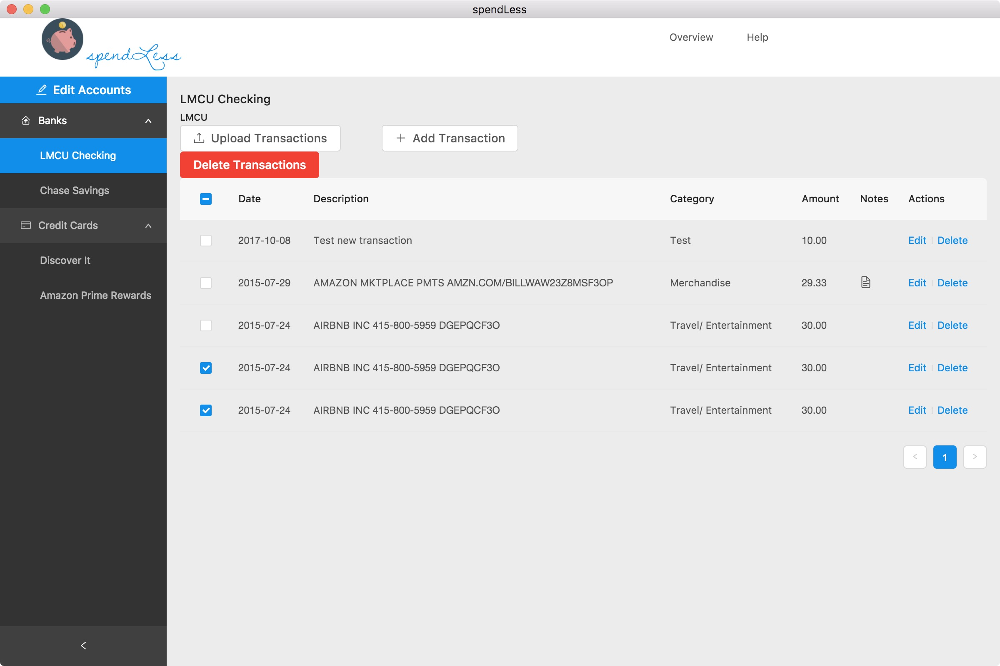

# spendLess

Personal finance tool built with the following goals:

- help users track their monthly income and expenses
- promote awareness of spending behavior and current financial health
- encourage users to spend less than they earn so they're able to put more money towards investments and savings, enabling them to retire comfortably and possibly even early.

(How it currently looks. Still lots of work to be done...)


## Install

Install dependencies.

```bash
npm install
```

## Run

```bash
npm start
```

Wait for the Electron app to load with the React UI

## View accounts/transactions data

Navigate to http://127.0.0.1:5984/_utils while the _start_ script is running to see a GUI of the PouchDB database

## Use

Test the CSV upload functionality by uploading one of the sample CSV files found inside the assets directory. (Currently only supports Discover credit card CSVs. More financial institutions will be supported in the future.)

**Note:** works with `node@10.13.0` and `npm@6.4.1`
