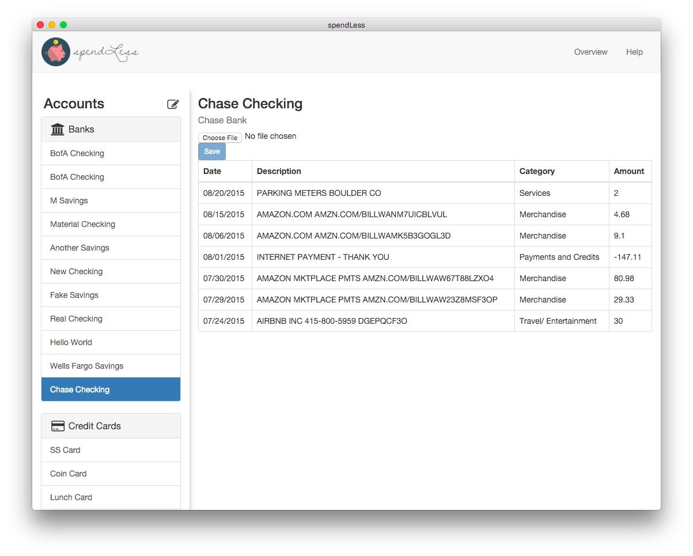

# spendLess
Personal finance tracker built using Electron, React, Redux, PouchDB, and React-Bootstrap. Compiled with Babel and bundled with Webpack.

(How it currently looks. Still lots of work to be done...)
[]

## Install

Install dependencies.

```bash
npm install
```

## Run

Run these two commands __in the order they're given__ and  __simultaneously__ in different terminal windows.

```bash
npm run hot-server
npm run start-hot
```

## Use

Test the CSV parsing function by uploading one of the sample CSV files found inside the assets directory.

*Note: requires a node version >= 4 and an npm version >= 2.*

Architecture for this app was inspired by react-transform-boilerplate, webpack-react-boilerplate, and electron-react-boilerplate
